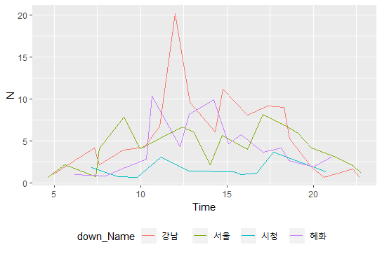
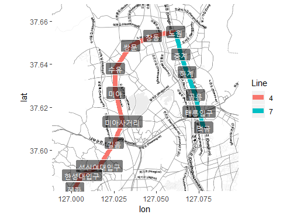

# seoulsubway

서울 지하철에 대한 내용이 담겨 있는 패키지입니다.  

이 패키지 내에는 서울 지하철에 대한 정보와 최단거리 함수 그리고 지도상의 표현이 가능한 함수가 포함되어 있습니다.


### _Install!_ 

devtools::install_github("king4k1/seoulsubway") 를 통하여 설치가능하며,

5000건의 경로 데이터샘플인 subway_sample를 이용하여 함수를 테스트하실 수 있습니다. 

```
if(!requireNamespace("devtools")) install.packages("devtools")
devtools::install_github("king4k1/seoulsubway")
```

<hr>

## subway_sample

총 5000건의 지하철 경로에 대한 정보를 포함하고 있습니다.

경로에는 1-8호선의 데이터만 고려합니다.

```r
library(seoulsubway)
data("subway_sample")

head(subway_sample)
```


### 시간대 별 역 하차객수 확인 

```r
subway_count <- subway_sample %>% group_by(Time, down_Name) %>% summarise(N=n())

# 4개의 역에 대한 결과 (예시)
subway_count <- filter(subway_count, down_Name%in%c("강남","혜화","시청", "서울"))

ggplot(subway_count, aes(x=Time, y=N, col=down_Name)) + geom_line(position = 'jitter') +  theme(legend.position="bottom")
```



## shortestpath

shortestpath 함수는 지하철 최단거리를 제공합니다.

총 13개의 노선(1-9호선과 신분당선, 분당선, 경의중앙선, 우이신설선)이 포함되어 있습니다.


### ex1. 먹골(7) -> 혜화(4)
```r
shortestpath(depart="먹골", depart_line="7", arrival = "혜화", arrival_line = "4",)
```


```r
library(nkmap)
pathplot(depart="먹골", depart_line="7", arrival = "혜화", arrival_line = "4",
         naver_secret ='uP1fgrNQID', naver_key='YvhIigePOgOCr1rKLcyT', 
         kakao_key ='bd0f02bafa236ced3eebb2d12845a306', zoom=8)
```



### ex2. 보문(6) -> 서울(4)
```r
shortestpath(depart="보문", depart_line="6", arrival = "서울", arrival_line = "4")
```


```r
pathplot(depart="보문", depart_line="6", arrival = "서울", arrival_line = "4",
         naver_secret ='uP1fgrNQID', naver_key='YvhIigePOgOCr1rKLcyT', 
         kakao_key ='bd0f02bafa236ced3eebb2d12845a306', zoom=8)
```


